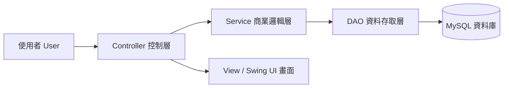
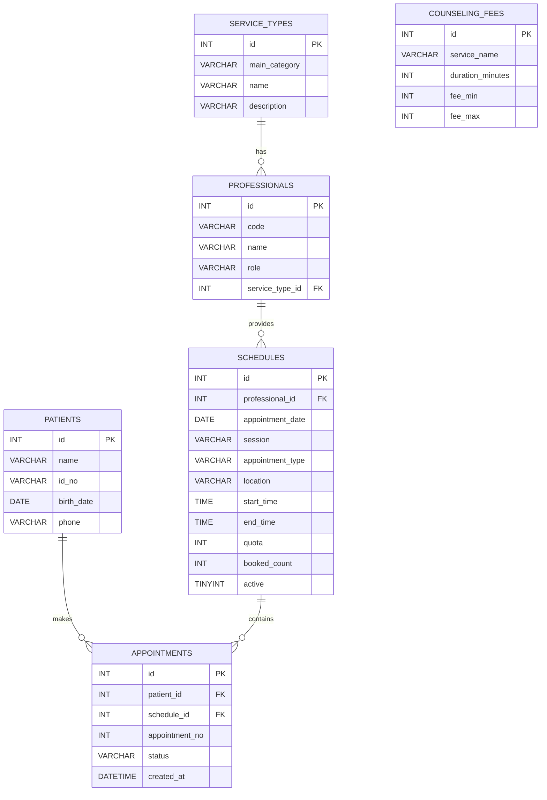

# 擁抱身心醫療預約系統  
**Embrace Mind Care System**

作者：**Reby**

---

## 一、專案簡介

本專案為一套以 **Java Swing + MySQL + Maven** 開發的桌面型預約系統，主題聚焦於：

1. **醫院精神科門診**
2. **心理諮商 / 心理治療**
3. **臨床心理衡鑑**

系統提供使用者進行預約、查詢、取消預約，以及查看當日看診 / 預約進度等功能，並採用 **MVC + DAO Pattern** 架構設計，方便後續維護與擴充。

---

## 二、開發環境

- **JDK 11**
- **MySQL 8.0**
- **Eclipse IDE**
- **WindowBuilder**
- **Maven Project**
- **Java Swing**

---

## 三、系統功能

### 1. 預約功能

- 依日期預約
- 依服務類別預約
- 依專業人員預約

### 2. 預約查詢功能

- 查詢 / 取消預約
- 可依下列條件查詢：
  - 身分證字號
  - 出生日期
  - 手機號碼

### 3. 看診 / 預約進度

- 顯示當日看診 / 預約進度
- 顯示：
  - 目前序號
  - 下一位
  - 未服務人數
  - 預約方式

### 4. 預約完成功能

- 顯示預約完成視窗
- 提供：
  - 預約資料摘要
  - 預約序號
  - 預約時間
  - 列印
  - 下載

### 5. 預約說明

- 門診時間表
- 諮商費用說明
- 預約注意事項

---

## 四、服務主軸

### 醫院精神科門診

- 高齡心智醫學中心
- 社區精神醫療服務
- 成癮醫學發展中心
- 藥癮醫療示範中心
- 腦刺激治療中心
- 兒童青少年精神醫學中心
- 司法精神醫學中心
- 心身醫學中心
- 睡眠中心

### 心理諮商 / 心理治療

- 心理諮商
- 心理治療

### 臨床心理衡鑑

- 臨床心理衡鑑
- 職能治療相關服務

---

## 五、諮商費用說明

| 項目 | 時間（分鐘） | 費用（NTD） |
|---|---:|---:|
| 個別諮商（成人 / 青少年） | 50 | 2200 - 3000 |
| 兒童個別諮商 | 50 | 2200 - 3000 |
| 伴侶諮商 | 80 | 3500 - 5200 |

---

## 六、專案架構圖

### 1. 系統分層架構圖



---

### 2. MVC + DAO 架構說明

- **Controller**
  - 接收使用者操作
  - 控制頁面切換
  - 呼叫 Service 執行商業邏輯

- **Service**
  - 處理預約流程
  - 驗證資料
  - 整合 DAO 取得資料

- **DAO**
  - 負責與 MySQL 溝通
  - 執行 SQL 查詢、新增、修改、刪除

- **Model**
  - 封裝系統資料物件

- **View / Swing UI**
  - 顯示畫面
  - 提供操作介面

---

## 七、專案資料夾架構圖

```mermaid
flowchart TD
    A[src/main/java] --> B[controller]
    A --> C[dao]
    C --> D[impl]
    A --> E[service]
    E --> F[impl]
    A --> G[model]
    A --> H[util]
    A --> I[exception]

    B --> B1[MainUI.java]
    B --> B2[DateReservationPanel.java]
    B --> B3[ServiceCategoryPanel.java]
    B --> B4[ProfessionalReservationPanel.java]
    B --> B5[QueryCancelPanel.java]
    B --> B6[ProgressPanel.java]
    B --> B7[InstructionPanel.java]
    B --> B8[RegisterDialog.java]
    B --> B9[AppointmentSuccessDialog.java]
    B --> B10[AbstractSchedulePanel.java]

    D --> D1[AppointmentDaoImpl.java]
    D --> D2[PatientDaoImpl.java]
    D --> D3[ProfessionalDaoImpl.java]
    D --> D4[ScheduleDaoImpl.java]
    D --> D5[ServiceTypeDaoImpl.java]
    D --> D6[CounselingFeeDaoImpl.java]

    F --> F1[AppointmentServiceImpl.java]

    G --> G1[Appointment.java]
    G --> G2[Patient.java]
    G --> G3[Professional.java]
    G --> G4[Schedule.java]
    G --> G5[ServiceType.java]
    G --> G6[CounselingFee.java]

    H --> H1[DbConnection.java]
    H --> H2[DateUtil.java]
    H --> H3[UIStyle.java]

    I --> I1[AppException.java]
```



---

## 八、ER Model 圖



---

## 九、資料表說明

### 1. service_types

存放服務主軸與服務類別，例如：

- 醫院精神科門診
- 心理諮商 / 心理治療
- 臨床心理衡鑑

### 2. professionals

存放專業人員資料，例如：

- 精神科醫師
- 臨床心理師
- 諮商心理師
- 職能治療師

### 3. schedules

存放可預約時段資料，例如：

- 預約日期
- 時段
- 預約項目
- 地點
- 開始 / 結束時間
- 名額
- 已預約數

### 4. patients

存放病患 / 預約者資料。

### 5. appointments

存放預約紀錄。

### 6. counseling_fees

存放諮商費用說明。

---

## 十、主要畫面說明

### 1. MainUI

系統主畫面，提供上方功能列切換：

- 依日期預約
- 依服務類別預約
- 依專業人員預約
- 查詢 / 取消預約
- 當日看診進度
- 預約說明

### 2. DateReservationPanel

依日期查詢當天可預約服務。

### 3. ServiceCategoryPanel

依服務類別查詢可預約時段。

### 4. ProfessionalReservationPanel

依專業人員查詢可預約時段。

### 5. QueryCancelPanel

查詢使用者預約紀錄，並可取消預約。

### 6. ProgressPanel

顯示當日看診 / 預約進度。

### 7. InstructionPanel

顯示：

- 門診時間表
- 諮商費用說明
- 預約注意事項

### 8. RegisterDialog

輸入預約者資料後完成預約。

### 9. AppointmentSuccessDialog

顯示預約完成資訊，並提供列印與下載功能。

---

## 十一、如何執行專案

### 1. 匯入 Maven Project

在 Eclipse 中選擇：

```text
File → Import → Existing Maven Projects
```

### 2. 建立 MySQL 資料庫

請先執行資料庫 SQL 腳本，建立資料庫與測試資料。

資料庫名稱：

```sql
embrace_mind_care
```

### 3. 設定資料庫連線

請確認 `DbConnection.java` 中的帳號密碼設定正確。

### 4. 執行主程式

執行：

```java
controller.MainUI
```

---

## 十二、使用技術

- Java Swing
- Maven
- JDBC
- MySQL
- MVC Pattern
- DAO Pattern
- WindowBuilder

---

## 十三、系統特色

- 以身心醫療主題作為專案情境
- 採用 MVC + DAO 分層設計
- 提供完整預約流程
- 可結合資料庫進行動態查詢
- 具備桌面型 Swing UI 畫面設計
- 可作為 Java 學習作品集

---

## 十四、注意事項

- 本系統為學習展示用途。
- 預約進度為示範資料計算，實際順序仍以現場為準。
- 心理諮商、臨床心理衡鑑、醫療門診仍應由專業人員實際評估與執行。

---

## 十五、作者資訊

**Author：Reby**

---
