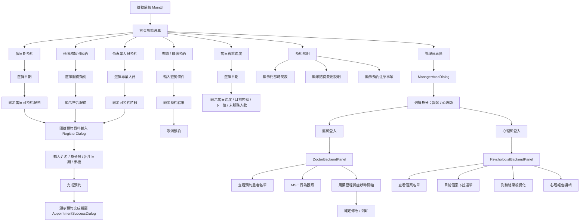
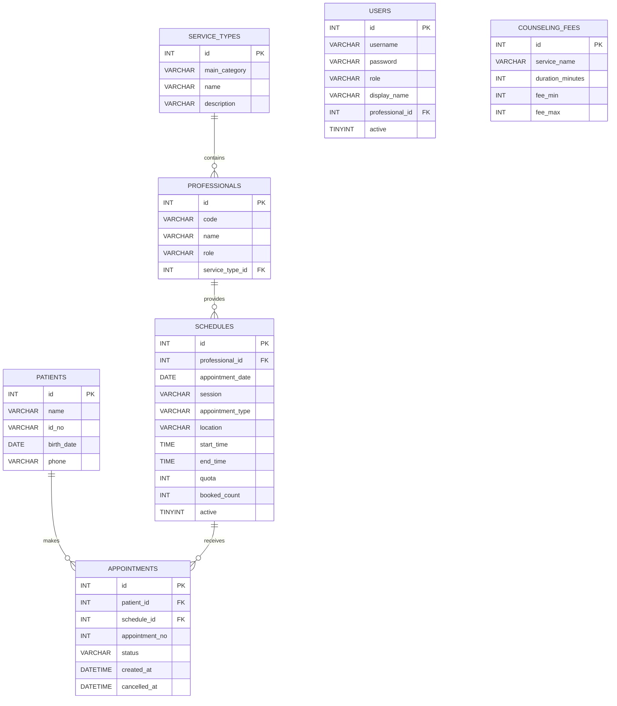

# 擁抱身心醫療預約系統  
**Embrace Mind Care System**

> 以 Java Swing + MySQL 開發的桌面式身心醫療預約系統，提供一般使用者預約功能，以及醫師 / 心理師後台管理功能。  
> 本專案以 **MVC + DAO Pattern** 架構設計，適合作為 Java 全端 / 後端轉職作品集展示。

---

## 作者

**Reby**

---

## 專案簡介

本系統模擬一套身心醫療相關的預約平台，主軸包含：

1. **醫院精神科門診**
2. **心理諮商 / 心理治療**
3. **臨床心理衡鑑**

系統除了提供一般民眾預約、查詢、取消功能外，也加入：

- 醫師後台管理
- 心理師後台管理
- 行為觀察（MSE）記錄
- 用藥歷程與症狀時間軸
- 預約完成視窗
- 諮商費用說明
- 依日期 / 依服務類別 / 依專業人員查詢

---

## 使用技術

- **Java JDK 11**
- **Java Swing / WindowBuilder**
- **MySQL 8.0**
- **Maven**
- **JDBC**
- **MVC + DAO Pattern**
- **JCalendar（JDateChooser）**

---

## 系統功能

### 一般使用者

- 依日期預約
- 依服務類別預約
- 依專業人員預約
- 查詢 / 取消預約
- 查看當日看診進度
- 查看預約說明
- 完成預約後顯示預約成功資訊

### 醫師後台

- 查看自己的預約患者名單
- 載入 MSE 範本
- 使用標籤矩陣快速記錄行為觀察
- 產生 MSE 結構化病歷文字
- 用藥歷程與症狀時間軸管理
- 確定修改用藥歷程與症狀時間軸
- 列印 MSE / 用藥時間軸內容

### 心理師後台

- 查看自己的預約個案
- 目前個案下拉選單連接預約姓名
- 查看心理測驗與參考資料
- 撰寫心理衡鑑 / 心理治療相關報告
- 視覺化測驗結果（Bell Curve / Radar Chart）
- 匯出與列印心理衡鑑報告

---

## 專案架構

```text
src/main/java
├─ controller
│  ├─ MainUI.java
│  ├─ DateReservationPanel.java
│  ├─ ServiceCategoryPanel.java
│  ├─ ProfessionalReservationPanel.java
│  ├─ QueryCancelPanel.java
│  ├─ ProgressPanel.java
│  ├─ InstructionPanel.java
│  ├─ RegisterDialog.java
│  ├─ AppointmentSuccessDialog.java
│  ├─ ManagerAreaDialog.java
│  ├─ LoginDialog.java
│  ├─ DoctorBackendPanel.java
│  └─ PsychologistBackendPanel.java
│
├─ model
│  ├─ Schedule.java
│  ├─ Patient.java
│  ├─ Appointment.java
│  ├─ Professional.java
│  ├─ ServiceType.java
│  └─ CounselingFee.java
│
├─ dao
│  ├─ ScheduleDao.java
│  ├─ AppointmentDao.java
│  ├─ PatientDao.java
│  ├─ ProfessionalDao.java
│  ├─ ServiceTypeDao.java
│  └─ CounselingFeeDao.java
│
├─ dao/impl
│  ├─ ScheduleDaoImpl.java
│  ├─ AppointmentDaoImpl.java
│  ├─ PatientDaoImpl.java
│  ├─ ProfessionalDaoImpl.java
│  ├─ ServiceTypeDaoImpl.java
│  └─ CounselingFeeDaoImpl.java
│
├─ service
│  └─ AppointmentService.java
│
├─ service/impl
│  └─ AppointmentServiceImpl.java
│
├─ util
│  ├─ DbConnection.java
│  ├─ DateUtil.java
│  └─ UIStyle.java
│
└─ exception
   └─ AppException.java
```

---

## MVC + DAO Pattern 說明

| 分層 | 說明 | 範例 |
|---|---|---|
| Model | 對應資料表與資料物件 | `Schedule`, `Patient`, `Appointment` |
| Controller / View | Swing UI 頁面與事件處理 | `MainUI`, `RegisterDialog` |
| DAO | 負責資料庫 CRUD 操作 | `ScheduleDaoImpl`, `AppointmentDaoImpl` |
| Service | 整合商業邏輯 | `AppointmentServiceImpl` |
| Util | 共用工具 | `DbConnection`, `DateUtil`, `UIStyle` |

---

# UI 流程圖



---

# ER-MODEL 圖



---

## 資料表說明

### `service_types`

儲存服務類型資料，例如：

- 高齡心智醫學中心
- 社區精神醫療服務
- 成癮醫學發展中心
- 心理諮商 / 心理治療
- 臨床心理衡鑑

### `professionals`

儲存專業人員資料，例如：

- 精神科醫師
- 臨床心理師
- 諮商心理師
- 職能治療師

### `schedules`

儲存可預約時段，包括：

- 日期
- 上午 / 下午 / 夜診
- 預約項目
- 地點
- 名額
- 已預約數

### `patients`

儲存病人 / 個案基本資料。

### `appointments`

儲存預約紀錄與狀態。

### `users`

儲存登入帳號與角色權限資料。

### `counseling_fees`

儲存心理諮商費用說明。

---

## 畫面設計風格

本專案主要 UI 色系：

- `#ebb2a3`
- `#fcf7f6`

風格方向：

- 柔和、溫暖、醫療感
- 適合身心醫療 / 心理健康主題
- 提升使用者親和感與可讀性

---

## 諮商費用說明

| 項目 | 時間（分鐘） | 費用（NTD） |
|---|---:|---:|
| 個別諮商（成人 / 青少年） | 50 | 2200 - 3000 |
| 兒童個別諮商 | 50 | 2200 - 3000 |
| 伴侶諮商 | 80 | 3500 - 5200 |

---

## 執行方式

### 1. 建立資料庫

先在 MySQL 匯入 `schema.sql` 或專案提供的 SQL 檔案。

### 2. 設定資料庫連線

請在：

```text
src/main/resources/db.properties
```

建立資料庫設定：

```properties
db.url=jdbc:mysql://localhost:3306/embrace_mind_care?useSSL=false&serverTimezone=Asia/Taipei&characterEncoding=UTF-8
db.user=root
db.password=你的密碼
```

### 3. 執行專案

在 Eclipse 中執行：

```text
controller.MainUI
```

---

## Maven 打包

```bash
mvn clean package
```

若已設定 `maven-shade-plugin`，可在 `target/` 內取得可執行 jar。

執行方式：

```bash
java -jar embrace-mind-care-system-1.0.0.jar
```

---

## jar 執行注意事項

若雙擊 jar 沒反應，請用 CMD 測試：

```bash
java -jar embrace-mind-care-system-1.0.0.jar
```

常見原因：

- MySQL Server 未啟動
- `embrace_mind_care` 資料庫不存在
- `db.properties` 密碼錯誤
- `db.properties` 沒有放在 `src/main/resources`
- 執行到 `original-xxx.jar` 而不是完整打包後的 jar

---

## 專案亮點

- 使用 **Java Swing + MySQL** 完成完整桌面式系統
- 使用 **MVC + DAO Pattern** 進行分層
- 有實作資料庫 CRUD 與預約邏輯
- 有加入 **醫師 / 心理師後台**
- 有加入 **MSE 行為觀察**
- 有加入 **用藥歷程與症狀視覺化概念**
- 有設計 **心理衡鑑報告工作區**
- 主題明確，結合醫療與心理專業背景，具有個人特色

---

## 未來可擴充功能

- 使用者登入 / 註冊
- 管理員帳號權限控管
- 報表匯出 PDF
- 預約簡訊 / Email 通知
- 線上付款
- REST API 版本
- Web 版前後端分離
- 行事曆同步
- 病歷 / 心理報告歷史版本管理

---

## 專案截圖建議放置

你可以在 GitHub 專案中新增 `images/` 資料夾，放入：

- 首頁畫面
- 依日期預約畫面
- 查詢 / 取消預約畫面
- 預約完成視窗
- 醫師後台 MSE 畫面
- 心理師後台報告畫面
- ER Model 圖
- UI 流程圖

範例：

```md
## 系統畫面展示


```

---

## 授權

本專案僅供學習、作品展示